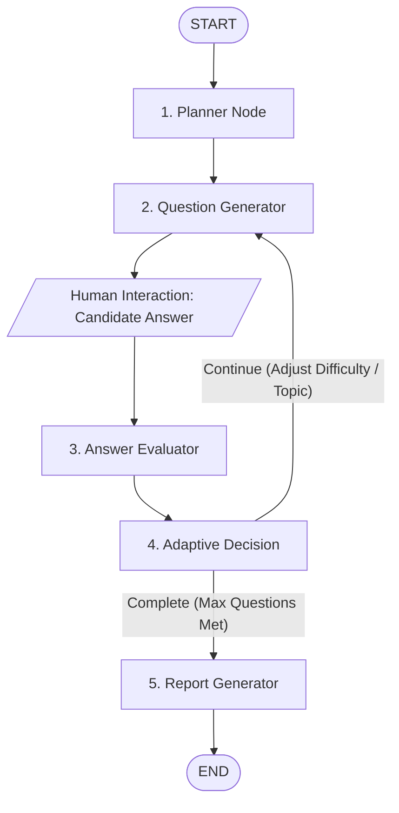

# InterviewIQ — Agentic AI Interview Assessment Platform

<p align="center">
  <a href="https://interviewiq-platform-1.onrender.com">
    
  </a>
  <a href="https://interviewiq-platform.onrender.com/docs">
    
  </a>
  
  
  
  
  
  
</p>

---

## 🌐 Live Deployment Links

* **Live Web Application (Frontend)**: [https://interviewiq-platform-1.onrender.com](https://interviewiq-platform-1.onrender.com)
* **Live REST API & Swagger Docs (Backend)**: [https://interviewiq-platform.onrender.com/docs](https://interviewiq-platform.onrender.com/docs)
* **Backend Health Check**: [https://interviewiq-platform.onrender.com/health](https://interviewiq-platform.onrender.com/health)

---

## 💡 Overview

**InterviewIQ** is a stateful, adaptive technical assessment platform. Unlike static question banks or conversational chatbots, InterviewIQ conducts dynamic technical interviews using a cyclic **LangGraph** state machine. 

It evaluates candidate answers across correctness, depth, and communication clarity, dynamically calibrates question difficulty based on demonstrated mastery or identified knowledge gaps, and produces an executive evaluation report.

---

## 🏗️ System Architecture

```text
┌────────────────────────────────────────────────────────┐
│              React 18 + Vite Frontend                  │
│       (Tailwind CSS, Single-Page App on Render)        │
└──────────────────────────┬─────────────────────────────┘
                           │ HTTPS REST APIs
                           ▼
┌────────────────────────────────────────────────────────┐
│                   FastAPI Backend                      │
│        (Checkpointer & Asynchronous Middleware)        │
└────────────┬─────────────────────────────┬─────────────┘
             │                             │
             ▼                             ▼
┌───────────────────────────┐  ┌───────────────────────────┐
│     MongoDB Atlas         │  │     LangGraph Engine      │
│ (Interviews, Questions,   │  │   5-Node Stateful Graph   │
│   Evaluations, Reports)   │  │ (Groq LPU / Llama & OSS)  │
└───────────────────────────┘  └───────────────────────────┘
```

---

## 🤖 The 5-Node Agentic Workflow



1. **`planner`**: Analyzes role and experience level to generate an initial interview strategy and baseline technical domains.
2. **`question_generator`**: Dynamically crafts non-repetitive, context-aware technical questions matching current topic and difficulty.
3. **`evaluator`**: Objectively grades responses across technical correctness, technical depth, and communication (0–10 scale).
4. **`adaptive_decision`**: Analyzes score trends to autonomously decide the next action (`increase_difficulty`, `decrease_difficulty`, `probe_weak_topic`, or `finish`).
5. **`report_generator`**: Synthesizes the full interview trajectory into a structured assessment scorecard with hiring readiness.

---

## 🛠️ Tech Stack

- **Agentic AI & LLMs**: LangGraph, LangChain, Groq LPUs (`openai/gpt-oss-20b`), LangSmith Tracing
- **Backend API**: FastAPI, Python 3.12, Pydantic v2, Uvicorn
- **Database & Persistence**: MongoDB Atlas, Motor (Async Driver)
- **Frontend SPA**: React 18, Vite 5, Tailwind CSS, Axios, React Router v6, Lucide Icons
- **DevOps & Deployment**: Render Cloud Platform, Docker, Docker Compose, Nginx

---

## 🚀 Running Locally

### 1. Clone the repository
```bash
git clone https://github.com/Shubham7049/InterviewIQ-Platform.git
cd InterviewIQ-Platform
```

### 2. Backend Setup
```bash
cd backend
python -m venv venv
# Windows:
venv\Scripts\activate
# Linux/macOS:
source venv/bin/activate

pip install -r requirements.txt
cp .env.example .env
# Edit .env with your GROQ_API_KEY and MONGODB_URI

python -m uvicorn app.main:app --reload
```
Backend runs at: `http://localhost:8000` (Docs: `http://localhost:8000/docs`)

### 3. Frontend Setup
```bash
cd ../frontend
npm install
cp .env.example .env
npm run dev
```
Frontend runs at: `http://localhost:5173`

---

## 🐳 Running with Docker Compose
```bash
docker compose up --build
```
- Frontend: `http://localhost:5173`
- Backend: `http://localhost:8000`

---

## 📜 Documentation & Guides
- [Technical Q&A Architecture Guide](INTERVIEW_QA_GUIDE.md)
- [Production Deployment Guide](DEPLOYMENT.md)

---

## 👤 Author
Developed by **Shubham Anand**  
GitHub: [@Shubham7049](https://github.com/Shubham7049)
